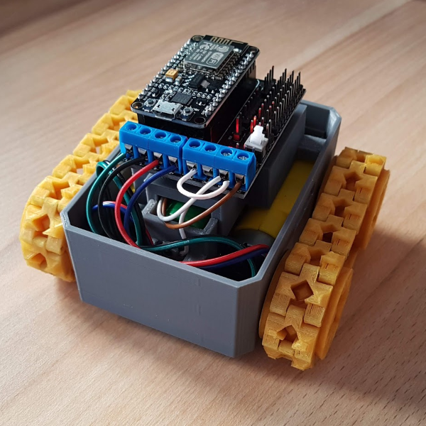
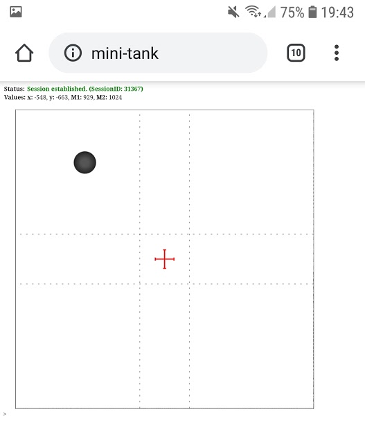

# Mini Tank

This project is based on the 3D-printed parts of [OTTO meets SMARS](https://www.thingiverse.com/thing:2818362) and contains an ESP8266 (NodeMCU) as controller including onboard WIFI support. 
The joystick or controller for the vehicle is a webpage which is deployed on the ESP8266.

## How to configure, build and run it?

## JoyStick
The joystick is a [webpage](src/webpage/index.html) deployed on the ESP8266 and can be used from all devices in the same network and which have a browser installed. 

## Part List
* ESP8266 NodeMCU v2 (There are two boards available with different widths. This one here has ca. 25mm width.)
* Esp8266 Nodemcu Motor Shield Drive Expansion Board ([Data Sheet](user-mannual-for-esp-12e-motor-shield.pdf))
* Battery 18650 3.7V
* Some wires and screws
* 3D printed parts
